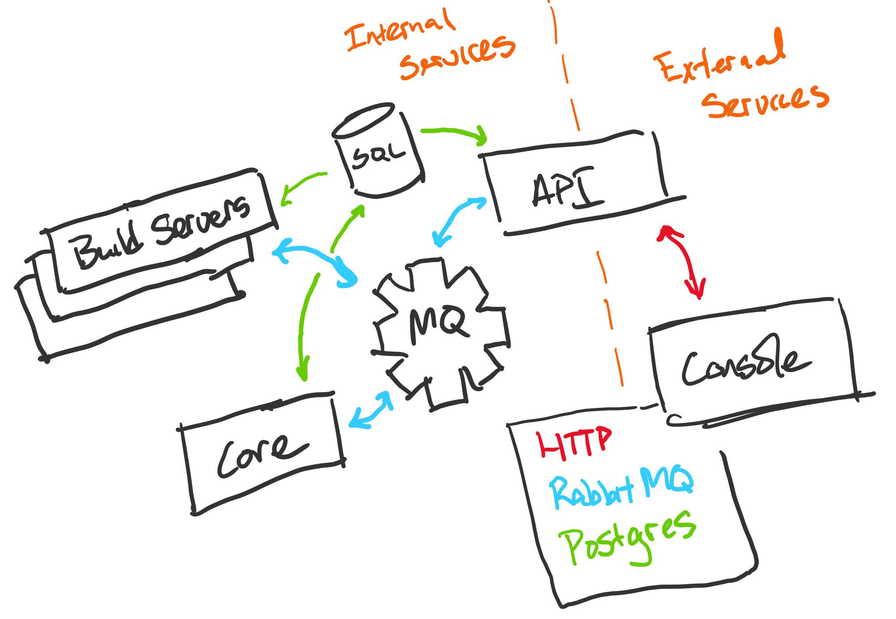

# Faction Components

Here you'll find a break down of various components within Faction

* [Services](components.md#services): The services that make up Faction
* [CLI](components.md#cli): The Faction CLI, used to manage a Faction installation

## Services

Faction consists of several services that communicate with each other through RabbitMQ and share data through PostgreSQL. This design allows individual services to easily be modified or new services added without effecting the rest the operation of the framework.

The diagram below provides a high level overview of how the services interact with each other.

### Console

The Console server acts as the public entry point to Faction. It handles hosting the console web application and provides access to the API service. Both the Faction console and API are accessed over HTTPS, meaning that you only need to expose TCP port 443.


For opsec and security reasons, it is _**highly**_ ****suggested that you use firewall rules to restrict access to the Console/API so that only your operatives and transport servers can access these services. Especially in production, agents should be connecting through transport servers \(like the [HTTP Transport](https://github.com/FactionC2/TransportHTTP/)\) to call back to Faction.


The console web application communicates directly with the API using a combination of HTTP and Websockets

### API

The API service provides access to all of Faction's features and serves as the authentication layer for Faction. It provides both REST and Socket.IO based APIs. Further details on using the API can be found in the [API documentation](../developing/api.md)

The API service generates RabbitMQ messages that are consumed by the Core service

### Core

The Core service acts as the brains behind Faction. It is responsible for processing and responding to all user and agent messages. One important thing to note about Factions design is that Core is the only service that decrypts agent messages. 

Core generates RabbitMQ messages that are consumed by the API service and any Build Services.

### Build Servers

Build servers provide a build environment for a given programming language. They're designed to be simple and unopinionated, running shell commands provided by build configs for [modules](../developing/modules/) and [agents](../developing/agents.md). The idea behind this is to allow developers to control the build process in a way that makes sense to them and allows Faction to easily be extended to support modules and agents in new languages.

Build Services generate RabbitMQ messages that are consumed by the API service.

#### .NET Build Service

The .NET build service provides a Mono development environment that can be used to build .NET modules and agents.

## CLI

Faction can be managed on the server its installed on through the Faction CLI. The following is an incomplete list of commands available through the CLI. Note that any command can be run with the `--help` parameter to learn more about it.

| Command | Description |
| :--- | :--- |
| `faction setup` | Used to setup Faction |
| `faction start` | Starts all faction containers |
| `faction restart` | Restarts all faction containers |
| `faction stop` | Stops all faction containers |
| `faction status` | Shows the status of all faction containers |
| `faction clean` | Depending on the parameter, removes files, containers, or the faction database |

